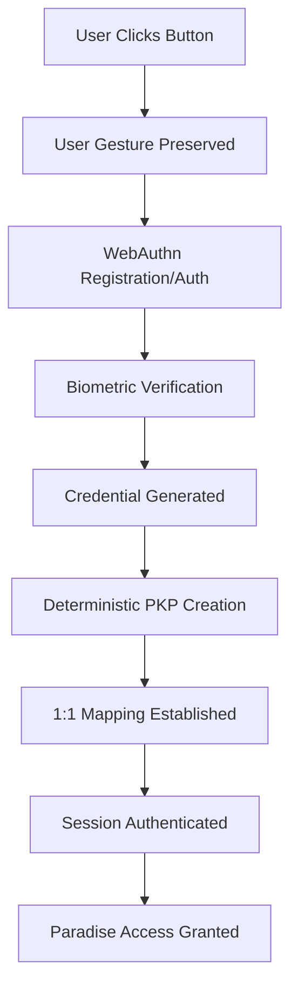
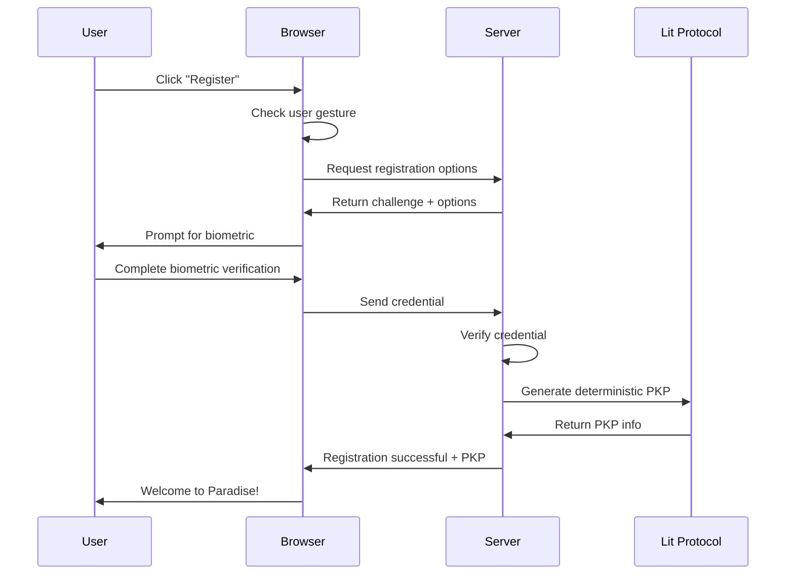
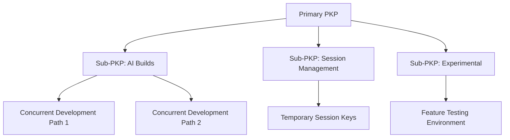

# 🏝️ The Beach - Tropical XR Paradise

<p align="center">
  <strong>A next-generation biometric-secured tropical metaverse with WebAuthn + Lit Protocol PKP integration</strong>
</p>

<p align="center">
  
  
  
  
  
  
  
</p>

> � **Revolutionary Authentication**: Experience the future of passwordless access with biometric WebAuthn authentication seamlessly integrated with Lit Protocol PKP management.

> �💡 **New here?** Check out the [Quick Start Guide](#-quick-start) to experience the tropical paradise in 5 minutes!

## 🌴 About

**The Beach** represents the cutting edge of Web3 metaverse technology - a fully immersive tropical paradise where your biometric identity becomes your key to a personalized digital world. Through revolutionary WebAuthn integration with Lit Protocol's Programmable Key Pairs (PKPs), users experience truly passwordless authentication while maintaining complete control over their digital identity.

Built with Babylon.js 8.x and enhanced with sophisticated multiplayer architecture, The Beach combines the beauty of a tropical escape with the security and innovation of next-generation Web3 authentication. Every interaction is secured by your unique biometric signature, creating a one-to-one mapping between your physical identity and your digital presence.

## 🚀 Revolutionary Features

### 🔐 **Next-Generation Authentication System**
- **🔑 WebAuthn Biometric Security**: Passwordless authentication using fingerprint, face recognition, Windows Hello, or device PIN
- **⚡ One-to-One PKP Mapping**: Revolutionary 1:1 credential-to-PKP relationship ensuring perfect identity consistency  
- **🎯 Deterministic PKP Generation**: Your unique PKP address is cryptographically derived from your biometric credentials
- **🛡️ Concurrent Request Protection**: Advanced locking mechanisms prevent authentication conflicts
- **🤝 User Gesture Preservation**: Sophisticated user interaction chain management for seamless WebAuthn flows
- **💾 Session Persistence**: Intelligent session management with 24-hour authentication windows
- **🐛 Debug Integration**: Comprehensive debugging tools for WebAuthn troubleshooting

### 🔑 **Advanced PKP Management Dashboard**
- **👑 Primary PKP Control**: Manage your main Programmable Key Pair with full administrative capabilities
- **🔧 Sub-PKP Minting**: Create specialized PKPs for different purposes (AI builds, concurrent development, session management)
- **📊 PKP Analytics**: Track PKP usage, creation history, and management capabilities
- **🤖 AI Build Path Management**: Dedicated PKPs for concurrent development and experimentation
- **🌳 Hierarchical PKP Structure**: Organized PKP ecosystem with clear parent-child relationships

### 🏝️ **Immersive Tropical Metaverse**
- **🌊 Photorealistic Beach Environment**: Animated ocean waves with realistic water physics and tropical atmosphere
- **🌴 Dynamic Palm Tree Forest**: Procedurally generated tropical vegetation with natural variations
- **💧 Living Ocean**: Real-time wave animations with specular lighting and transparency effects
- **☁️ Tropical Skybox**: Dynamic sky system with animated clouds and atmospheric effects
- **🏖️ Interactive Decorations**: Floating tropical elements and environmental interactions
- **🥽 WebXR Ready**: Full VR/AR support for Meta Quest, PICO, and WebXR-compatible devices

### � **Sophisticated Audio Integration**
- **🎶 SoundCloud Widget**: Seamless "Ocean Breeze" ambient soundtrack integration
- **🔊 Advanced Audio Controls**: Real-time volume adjustment, play/pause, and audio state management
- **🎚️ Spatial Audio Ready**: Positioned audio sources for immersive 3D sound experience
- **🎵 Automatic Audio Management**: Smart audio initialization with user interaction compliance

### 👥 **Real-Time Multiplayer Ecosystem**
- **⚡ Socket.IO Infrastructure**: High-performance real-time communication with connection management
- **👤 Dynamic Avatar System**: Procedural avatar generation with unique visual identities
- **📹 WebRTC Integration**: Peer-to-peer video/audio chat for social interaction
- **📈 Session Analytics**: Track multiplayer sessions, duration, and user engagement
- **🔄 Player State Management**: Real-time position updates and interaction synchronization

### 🤖 **AI-Powered Development Platform**
- **🔒 PKP-Protected AI Builds**: AI development paths secured by individual PKPs
- **🔀 Concurrent Development**: Multiple AI build paths running simultaneously with sub-PKP management
- **✨ Intelligent Scene Generation**: AI-assisted tropical environment creation and enhancement
- **🤝 Collaborative AI**: Community-driven development with PKP-verified contributions
- **📊 Build Path Analytics**: Track AI development iterations and success metrics

### 🛡️ **Enterprise-Grade Security**
- **🔐 WebAuthn Guard System**: Route-level protection requiring biometric verification
- **🎫 Session-Based Authorization**: Secure session management with automatic expiration
- **💾 Credential Storage**: Encrypted credential storage with JSON persistence
- **🌐 Origin Validation**: Strict origin checking for WebAuthn security compliance
- **🏷️ RPID Management**: Proper Relying Party identification for multi-domain support

### ⚡ **Performance & Scalability**
- **📦 Optimized Asset Loading**: Progressive loading with smooth scene transitions
- **🖼️ Canvas Management**: Advanced canvas resizing and rendering optimization
- **🧹 Memory Management**: Efficient resource cleanup and garbage collection
- **⏳ Loading States**: Beautiful loading overlays with progress indication
- **❌ Error Handling**: Comprehensive error management with user-friendly messages

### 🛠️ **Technical Excellence**
- **🏗️ NestJS 11.x Backend**: Modern TypeScript server architecture with decorator-based routing
- **🎮 Babylon.js 8.x Engine**: Latest WebGL/WebGPU rendering with advanced features
- **🔥 Lit Protocol 7.x**: Cutting-edge PKP management and session signature generation
- **� SimpleWebAuthn**: Industry-standard WebAuthn implementation with full browser support
- **🍪 Express Sessions**: Robust session management with in-memory and persistent storage options
- **⚡ Socket.IO 4.x**: Real-time bidirectional communication with automatic reconnection

## 🎯 Quick Start

### Prerequisites

- **Node.js** 18.0.0 or higher (recommended: 20.x)
- **npm** or **yarn**
- A modern browser with WebAuthn support (Chrome 67+, Firefox 60+, Safari 14+, Edge 88+)
- Optional: Biometric authentication device (fingerprint reader, camera for face recognition, Windows Hello)
- Optional: VR headset with WebXR support (Meta Quest, PICO, HTC Vive)

### 🚀 Installation & Setup

1. **Clone the repository**
   ```bash
   # To use the app:
   git clone https://github.com/jasonsprouse/the-beach.git
   cd the-beach
   
   # To contribute, fork first then clone your fork:
   # git clone https://github.com/YOUR_USERNAME/the-beach.git
   ```

2. **Install dependencies**
   ```bash
   npm install
   ```

3. **Build the project**
   ```bash
   npm run build
   ```

4. **Start the development server**
   ```bash
   npm run start:dev
   ```

5. **🔐 Experience Biometric Authentication**
   
   Navigate to `http://localhost:3000` and experience the future of passwordless authentication:
   
   - **First Visit**: Click "Register with WebAuthn" to create your biometric credential
   - **Biometric Setup**: Follow your browser's prompts for fingerprint, face recognition, or device PIN
   - **PKP Generation**: Your unique Programmable Key Pair is automatically generated
   - **Paradise Access**: Click "Load Paradise" to enter your PKP-protected tropical metaverse!

### 🏝️ Entering Paradise

Once authenticated, navigate to the tropical paradise:

1. **Visit the XR Environment**: Go to `http://localhost:3000/xr`
2. **Biometric Verification**: Your session will be automatically verified
3. **Load Paradise**: Click "🌴 Load Paradise" to initialize your tropical escape
4. **Explore**: Use WASD keys to move around the beach environment
5. **Enter VR**: Click "🥽 Enter VR" if you have a WebXR-compatible headset

### 🎵 Audio Experience

- **Ocean Breeze Soundtrack**: Enjoy the ambient "Ocean Breeze" track by Jason Sprouse
- **Volume Controls**: Adjust audio levels using the integrated SoundCloud widget
- **Auto-Play**: Music starts automatically at low volume after user interaction

### 🔐 WebAuthn Features

Experience cutting-edge biometric authentication:

- **Passwordless Login**: No passwords required - just your biometric signature
- **Device Flexibility**: Works with fingerprint readers, face recognition, Windows Hello, or device PINs
- **One-to-One Mapping**: Each biometric credential maps to exactly one PKP
- **Session Persistence**: Stay authenticated for 24 hours with automatic renewal
- **Debug Tools**: Access browser console for advanced WebAuthn debugging functions

### 🔑 PKP Management

Explore your Programmable Key Pair capabilities:

```javascript
// In browser console, try these debug commands:
debugWebAuthn.getState()           // Check authentication state
debugWebAuthn.checkOneToOneMapping() // Verify your 1:1 PKP mapping
debugWebAuthn.testUserGesture()    // Test user interaction preservation
```

Access your PKP dashboard through authenticated endpoints:
- **PKP Dashboard**: `/lit/pkp/dashboard` - View your primary and sub-PKPs
- **AI Build Paths**: `/lit/pkp/ai-builds` - Manage AI development paths
- **Session Status**: `/lit/session/status` - Check authentication status

### Production Deployment

For production deployment, see [DEPLOY.md](./DEPLOY.md) which includes detailed instructions for deploying to Vercel.

Quick deploy to Vercel:
```bash
npm i -g vercel
vercel --prod
```

## 🔐 WebAuthn + PKP Integration

### Authentication Flow

The Beach implements a revolutionary authentication system that combines WebAuthn biometric security with Lit Protocol's Programmable Key Pairs:



### Key Features

#### 🎯 **One-to-One Credential Mapping**
- Each user maintains exactly **one WebAuthn credential** mapped to **one primary PKP**
- Eliminates credential conflicts and ensures consistent identity
- New registrations replace existing credentials for perfect 1:1 mapping

#### 🔒 **Deterministic PKP Generation**
```typescript
// PKP addresses are deterministically generated from:
const seed = `${username}:${credentialID}`;
const hash = crypto.createHash('sha256').update(seed).digest();
const pkpAddress = '0x' + hash.slice(-20).toString('hex');
```

#### 🛡️ **Advanced Security Features**
- **Concurrent Request Protection**: Prevents multiple simultaneous WebAuthn operations
- **User Gesture Preservation**: Maintains user activation throughout async operations
- **Session Validation**: 24-hour rolling session windows with automatic renewal
- **Origin Verification**: Strict origin checking for WebAuthn security

#### 🔧 **Sub-PKP Management**
Primary PKPs can mint specialized sub-PKPs for different purposes:
- **AI Build Paths**: Dedicated PKPs for concurrent development
- **Session Management**: Temporary PKPs for session-specific operations
- **Experimental Features**: Sandbox PKPs for testing new capabilities

### API Endpoints

#### Authentication Routes
```typescript
POST /lit/webauthn/register-options     // Get WebAuthn registration options
POST /lit/webauthn/verify-registration  // Verify registration and create PKP
POST /lit/webauthn/authenticate-options // Get authentication options  
POST /lit/webauthn/verify-authentication // Verify auth and activate session
GET  /lit/session/status               // Check authentication status
POST /lit/session/logout               // Clear session and logout
```

#### PKP Management Routes
```typescript
GET  /lit/pkp/dashboard                // PKP management dashboard
POST /lit/pkp/mint                     // Mint new sub-PKP
GET  /lit/pkp/ai-builds               // AI development paths
GET  /lit/user/profile                // User profile and stats
```

#### Protected Routes
```typescript
POST /xr/load-paradise                // Load tropical paradise (requires auth)
GET  /xr/analytics                    // User session analytics
POST /xr/session/end                  // End XR session
```

### WebAuthn Browser Support

| Browser | Version | Support Level |
|---------|---------|---------------|
| Chrome | 67+ | ✅ Full Support |
| Firefox | 60+ | ✅ Full Support |
| Safari | 14+ | ✅ Full Support |
| Edge | 88+ | ✅ Full Support |
| Opera | 54+ | ✅ Full Support |

### Debug Functions

The Beach includes comprehensive debugging tools for WebAuthn development:

```javascript
// Available in browser console:
debugWebAuthn.getState()              // Get complete authentication state
debugWebAuthn.resetState()            // Reset locks and clear state
debugWebAuthn.testAuth()              // Test authentication with logging
debugWebAuthn.checkSupport()          // Check WebAuthn browser support
debugWebAuthn.testConcurrentRequests() // Test concurrent protection
debugWebAuthn.checkOneToOneMapping()  // Verify 1:1 credential mapping
debugWebAuthn.testUserGesture()       // Test user gesture preservation
```

## 🏗️ Architecture

### Technology Stack

#### Frontend
- **Babylon.js 8.x**: WebGL/WebGPU rendering engine with full WebXR support
- **WebAuthn API**: Native browser biometric authentication
- **Socket.IO Client**: Real-time multiplayer communication
- **SoundCloud Widget API**: Integrated audio streaming
- **WebRTC**: Peer-to-peer video/audio communication

#### Backend
- **NestJS 11.x**: Modern TypeScript server framework
- **SimpleWebAuthn**: Industry-standard WebAuthn implementation
- **Lit Protocol SDK**: PKP management and session signatures
- **Socket.IO**: Real-time bidirectional communication
- **Express Sessions**: Secure session management

#### Security & Authentication
- **WebAuthn**: Passwordless biometric authentication
- **Lit Protocol**: Programmable Key Pair management
- **PKP Deterministic Generation**: Cryptographic identity derivation
- **Session Guards**: Route-level authentication protection

### Project Structure

```
src/
├── lit/                    # Lit Protocol & WebAuthn integration
│   ├── lit.controller.ts   # 12 endpoints for auth & PKP management
│   ├── lit.service.ts      # Core Lit Protocol service
│   └── webauthn-auth.guard.ts # WebAuthn route protection
├── xr/                     # XR environment & multiplayer
│   └── xr.controller.ts    # Paradise loading & session management
├── events/                 # Socket.IO real-time events
│   ├── events.gateway.ts   # WebSocket event handling
│   └── events.module.ts    # Events module configuration
├── auth/                   # Authentication infrastructure
│   └── auth.guard.ts       # Multi-layer auth guard
└── main.ts                 # Application bootstrap

public/
├── js/
│   ├── useLit.js          # WebAuthn + PKP client integration
│   └── xr-scene.js        # Babylon.js tropical paradise
├── xr-environment.html    # XR interface with WebAuthn modals
└── index.html             # Landing page with authentication
```

### WebAuthn Implementation Details

#### Registration Flow
1. **User Gesture Check**: Verify user interaction before WebAuthn calls
2. **Challenge Generation**: Server generates cryptographic challenge
3. **Credential Creation**: Browser creates biometric credential
4. **Verification**: Server verifies credential and generates PKP
5. **Session Establishment**: User session activated with PKP info

#### Authentication Flow
1. **Session Check**: Verify existing session before prompting
2. **Challenge Request**: Get authentication challenge from server
3. **Biometric Verification**: User completes biometric authentication
4. **PKP Retrieval**: Server returns deterministic PKP information
5. **Paradise Access**: User gains access to protected XR environment

#### Error Handling
- **User Gesture Expired**: Clear guidance for fresh interaction
- **Concurrent Requests**: Protection against simultaneous operations
- **Credential Conflicts**: Automatic resolution with 1:1 mapping
- **Browser Compatibility**: Graceful fallbacks for unsupported browsers

## 🎮 How to Experience The Beach

### 🔐 Authentication Experience

1. **Biometric Registration**: First-time users complete WebAuthn registration with fingerprint, face recognition, or device PIN
2. **PKP Generation**: Your unique Programmable Key Pair is automatically created and mapped to your biometric credential
3. **Seamless Access**: Future visits authenticate instantly with your biometric signature
4. **Paradise Unlocked**: Authenticated users gain access to the full tropical metaverse

### 🖥️ Desktop Controls (Non-VR)

- **W/A/S/D or Arrow Keys** - Navigate the tropical paradise
- **Mouse** - Look around (click and drag for camera control)
- **E** - Move up (fly upward)
- **Q** - Move down (descend)
- **Space** - Jump/interact with objects
- **ESC** - Exit fullscreen or VR mode

### 🥽 VR Controls

- **VR Controllers** - Point and teleport using tropical markers
- **Joystick/Thumbstick** - Smooth locomotion through the environment
- **Hand Tracking** - Natural interaction with objects (device-dependent)
- **Voice Commands** - "Load Paradise" to enter authenticated areas

### 👥 Multiplayer & Social Features

- **Automatic Voice/Video**: WebRTC-powered communication when joining sessions
- **Real-time Avatars**: See other authenticated users in the tropical environment
- **PKP-Verified Interactions**: All social features secured by biometric authentication
- **Session Analytics**: Track your time in paradise and interaction statistics

## 🔧 Development & Architecture

### 🏗️ Enhanced Project Structure

```
the-beach/
├── src/                           # Backend (NestJS + WebAuthn + PKP)
│   ├── lit/                      # 🔐 Lit Protocol & WebAuthn integration
│   │   ├── lit.controller.ts     # 12 endpoints for auth & PKP management
│   │   ├── lit.service.ts        # Core Lit Protocol service
│   │   └── webauthn-auth.guard.ts # Route-level biometric protection
│   ├── xr/                       # 🏝️ XR environment & session management
│   │   └── xr.controller.ts      # Paradise loading with PKP verification
│   ├── events/                   # ⚡ Socket.IO real-time multiplayer
│   │   ├── events.gateway.ts     # WebSocket event handling
│   │   └── events.module.ts      # Events module configuration
│   ├── auth/                     # 🛡️ Multi-layer authentication
│   │   └── auth.guard.ts         # Session + token auth guard
│   ├── app.module.ts             # Main application module
│   └── main.ts                   # Application bootstrap
├── public/                       # Frontend (Babylon.js + WebAuthn)
│   ├── js/
│   │   ├── useLit.js            # 🔑 WebAuthn + PKP client integration
│   │   └── xr-scene.js          # 🌴 Tropical paradise with auth integration
│   ├── xr-environment.html      # 🏝️ Main XR interface with biometric modals
│   └── index.html               # 🏠 Landing page with authentication
├── webauthn-users.json          # 💾 Encrypted credential storage
├── package.json
└── README.md
```

### 🚀 Available Scripts

- `npm run start` - Production server with full WebAuthn + PKP support
- `npm run start:dev` - Development mode with hot-reload and debug tools
- `npm run build` - Build TypeScript backend with optimization
- `npm run test` - Run unit tests including WebAuthn flows
- `npm run test:e2e` - End-to-end tests with biometric simulation
- `npm run lint` - Lint code with WebAuthn best practices
- `npm run format` - Format code with Prettier

### 🔗 Enhanced API Endpoints

#### 🔐 Authentication & PKP Management
- `GET /lit/config` - Lit Protocol configuration status
- `GET /lit/session/status` - Check authentication and PKP status
- `POST /lit/session/logout` - Clear session and revoke access
- `GET /lit/user/profile` - User profile with PKP information
- `POST /lit/webauthn/register-options` - Get WebAuthn registration challenge
- `POST /lit/webauthn/verify-registration` - Verify registration and create PKP
- `POST /lit/webauthn/authenticate-options` - Get authentication challenge
- `POST /lit/webauthn/verify-authentication` - Verify auth and activate session
- `GET /lit/pkp/dashboard` - PKP management dashboard
- `POST /lit/pkp/mint` - Mint new sub-PKP for specific purposes
- `GET /lit/pkp/ai-builds` - AI development paths with PKP protection

#### 🏝️ Protected Paradise Access
- `GET /xr` - Tropical XR environment (guest access for viewing)
- `POST /xr/load-paradise` - Load full paradise (requires WebAuthn auth)
- `GET /xr/analytics` - User session analytics and XR metrics
- `POST /xr/session/end` - End XR session with duration tracking
- `GET /xr/demo` - Demo scene with limited features
- `GET /xr/info` - Paradise information and feature list

#### ⚡ Real-time Communication
- `WebSocket ws://localhost:3000` - Multiplayer with PKP-verified users
- Real-time events: `userJoined`, `userLeft`, `userMoved`, `voiceChat`

## 🤝 Contributing to The Beach

We welcome contributions to make The Beach the premier biometric-secured tropical metaverse! Here's how you can help:

### 🌟 How to Contribute

1. **Fork the Repository**
   
   Click the "Fork" button to create your own copy with full WebAuthn + PKP functionality.

2. **Create a Feature Branch**
   ```bash
   git checkout -b feature/your-amazing-feature
   ```

3. **Set Up Development Environment**
   ```bash
   npm install
   npm run build
   npm run start:dev
   ```
   
   Test the WebAuthn flow by visiting `http://localhost:3000` and registering with biometrics.

4. **Make Your Changes**
   
   Follow existing patterns for WebAuthn integration. Ideas for contributions:
   - Enhance tropical environment with new 3D assets
   - Improve WebAuthn user experience and error handling
   - Add new PKP management features
   - Implement additional biometric authentication methods
   - Create new WebXR interactions and teleportation systems
   - Expand multiplayer features with PKP-verified social interactions
   - Add AI-powered scene generation with PKP protection

5. **Test Thoroughly**
   ```bash
   # Test the full authentication flow
   npm run test
   
   # Test in browser with WebAuthn
   # Visit http://localhost:3000 and test:
   # - Biometric registration
   # - Authentication with stored credentials
   # - Paradise loading with PKP verification
   # - VR mode functionality
   ```

6. **Commit and Push**
   ```bash
   git add .
   git commit -m "feat: add biometric-protected AI scene generator"
   git push origin feature/your-amazing-feature
   ```

7. **Open a Pull Request**
   
   Include details about WebAuthn compatibility and PKP integration testing.

### 🎨 Creating New PKP-Protected Scenes with AI

Extend The Beach with AI-generated environments that leverage PKP authentication:

#### Step 1: Design Your Scene

Choose a theme and plan PKP integration:
- **🌊 Underwater Atlantis** - PKP-gated ancient wisdom chambers
- **🌌 Space Observatory** - Biometric-locked telescope controls
- **🏰 Fantasy Realm** - WebAuthn-protected magical artifacts
- **🏔️ Arctic Research Station** - PKP-verified scientific data access

#### Step 2: Use AI for Code Generation

Prompt example for AI assistants:

```
I'm building a WebAuthn + PKP secured tropical metaverse using Babylon.js and NestJS.
I need to create a new scene: [YOUR_SCENE_DESCRIPTION]

Requirements:
- Integrate with existing WebAuthn authentication system
- Include PKP-protected areas requiring biometric verification
- Support WebXR teleportation and VR controllers
- Follow the existing project structure in /src/xr/ and /public/js/
- Include proper error handling for authentication failures
- Add Socket.IO multiplayer support for authenticated users

Please provide TypeScript code for both the NestJS controller and Babylon.js scene.

Here's the existing auth structure: [paste relevant code from lit.controller.ts]
```

#### Step 3: Implement PKP-Protected Features

```typescript
// Example: PKP-protected treasure chest
const createPKPTreasureChest = async (scene) => {
  const chest = BABYLON.MeshBuilder.CreateBox("treasureChest", {size: 2}, scene);
  
  chest.actionManager = new BABYLON.ActionManager(scene);
  chest.actionManager.registerAction(new BABYLON.ExecuteCodeAction(
    BABYLON.ActionManager.OnPickTrigger, 
    async () => {
      // Verify PKP authentication before opening
      const lit = window.useLit();
      const authState = lit.getAuthenticationState();
      
      if (authState.currentUser) {
        // Open chest with PKP verification
        const pkpDashboard = await lit.getPKPDashboard();
        console.log('🔑 PKP verified, opening treasure:', pkpDashboard);
        animateChestOpening(chest);
      } else {
        // Prompt for biometric authentication
        showAuthPrompt("🔐 Biometric authentication required to open treasure");
      }
    }
  ));
};
```

#### Step 4: Test WebAuthn Integration

1. **Register New Scene Route**:
   ```typescript
   // In src/xr/xr.controller.ts
   @Get('new-scene')
   getNewScene(@Res() res: Response) {
     return res.sendFile(join(process.cwd(), 'public', 'new-scene.html'));
   }
   
   @Post('new-scene/protected-area')
   @UseGuards(WebAuthnAuthGuard)
   accessProtectedArea(@Session() session: UserSession) {
     return {
       success: true,
       message: 'PKP-protected area accessed',
       pkpInfo: this.getPKPForUser(session.username)
     };
   }
   ```

2. **Test Authentication Flow**:
   ```bash
   # Start development server
   npm run start:dev
   
   # Test in browser:
   # 1. Visit http://localhost:3000/xr/new-scene
   # 2. Attempt to access protected features
   # 3. Complete WebAuthn authentication
   # 4. Verify PKP-protected content unlocks
   # 5. Test in VR mode if available
   ```

### 🔐 WebAuthn Development Guidelines

When contributing WebAuthn features:

#### Security Best Practices
```typescript
// ✅ Always preserve user gesture
const handleInteraction = async (event) => {
  // Check user gesture immediately
  if (!navigator.userActivation?.isActive) {
    throw new Error('User interaction required');
  }
  
  // Perform WebAuthn operation immediately
  const credential = await navigator.credentials.create(options);
};

// ✅ Implement proper error handling
try {
  await authenticateWebAuthn(username);
} catch (error) {
  if (error.message.includes('user interaction')) {
    showUserFriendlyMessage('Please click the button and try again');
  }
}

// ✅ Use the provided concurrent protection
const lit = window.useLit();
if (lit.isWebAuthnBusy()) {
  console.log('WebAuthn operation in progress, please wait');
  return;
}
```

#### PKP Integration Patterns
```typescript
// ✅ Check PKP authentication before protected actions
const verifyPKPAccess = async (requiredLevel = 'basic') => {
  const lit = window.useLit();
  const authState = lit.getAuthenticationState();
  
  if (!authState.currentUser) {
    const username = await lit.login();
    if (!username) throw new Error('Authentication required');
  }
  
  const pkpDashboard = await lit.getPKPDashboard();
  return pkpDashboard.primaryPKP;
};

// ✅ Mint sub-PKPs for specific features
const enableAdvancedFeatures = async () => {
  const lit = window.useLit();
  const subPKP = await lit.mintSubPKP('advanced-features', 'Enhanced scene interactions');
  console.log('🔧 Advanced features PKP:', subPKP.subPKP.address);
};
```

### 💡 Contribution Ideas

#### 🔐 Authentication Enhancements
- Multi-device PKP synchronization
- Biometric authentication recovery flows
- Enhanced WebAuthn debugging tools
- Cross-browser compatibility improvements

#### 🏝️ Environment Expansions
- Seasonal tropical variations (storms, sunsets, night mode)
- Interactive wildlife with PKP-protected special interactions
- Hidden areas unlocked by PKP verification
- Weather system controlled by authenticated users

#### 🎮 Gameplay Features
- PKP-protected inventory system
- Biometric-locked treasure hunts
- WebAuthn-verified multiplayer competitions
- AI-generated quests tied to user PKPs

#### 🛠️ Technical Improvements
- WebXR hand tracking integration
- Advanced physics with tropical elements
- Performance optimizations for VR
- Enhanced audio with spatial positioning

### 🎨 Creating New Scenes with AI

One of the most exciting ways to extend The Beach is by creating new scenes! Here's how to use AI tools like ChatGPT, Claude, or GitHub Copilot to generate new environments:

#### Step 1: Fork and Branch

```bash
# Fork the repo on GitHub, then clone your fork
git clone https://github.com/YOUR_USERNAME/the-beach.git
cd the-beach
git checkout -b feature/new-scene-underwater-cave
```

#### Step 2: Use AI to Generate Scene Code

Ask an AI assistant to help you create a new Babylon.js scene. Here's an example prompt:

```
I'm working on a Babylon.js WebXR project. I need to create an underwater cave scene 
with the following features:
- Bioluminescent plants on cave walls
- Schools of fish swimming around
- Underwater lighting effects with caustics
- Collision detection for cave walls
- Teleportation points using glowing crystals
- Ambient underwater sound effects

Please provide the JavaScript/TypeScript code for creating this scene in Babylon.js,
following the structure in this example: [paste relevant code from xr-scene.js]
```

#### Step 3: Integrate the AI-Generated Scene

1. Create a new scene file in `public/js/`:
   ```bash
   touch public/js/underwater-cave-scene.js
   ```

2. Paste and adapt the AI-generated code, making sure to:
   - Follow the existing code structure and patterns
   - Use consistent naming conventions
   - Add proper error handling
   - Include collision detection
   - Add WebXR teleportation support

3. Create a new HTML page or route for your scene:
   ```bash
   cp public/index.html public/underwater-cave.html
   ```
   
   Update the script reference to load your new scene file.

4. Add a controller route in `src/xr/xr.controller.ts`:
   ```typescript
   @Get('underwater-cave')
   getUnderwaterCave(@Res() res: Response) {
     return res.sendFile(join(process.cwd(), 'public', 'underwater-cave.html'));
   }
   ```

#### Step 4: Test and Refine

```bash
npm run build
npm run start:dev
```

Visit `http://localhost:3000/xr/underwater-cave` and test your new scene. Iterate with the AI assistant to fix any issues or add enhancements.

#### Step 5: Document and Share

Add documentation for your new scene:
- Update the README with information about the new scene
- Add screenshots or videos
- Document any new controls or interactions
- Update the `/xr/info` endpoint to include your scene

### 💡 Ideas for New Scenes

Here are some scene ideas you can create with AI assistance:

- 🌲 **Forest Retreat** - Dense forest with wildlife and treehouse
- 🏔️ **Mountain Summit** - Snowy peak with aurora borealis
- 🌙 **Moonbase** - Sci-fi lunar station with Earth views
- 🏛️ **Ancient Temple** - Mysterious ruins with puzzles
- 🌊 **Underwater City** - Submerged Atlantis-style metropolis
- 🏜️ **Desert Oasis** - Sand dunes with palm tree oasis
- 🌌 **Space Station** - Zero-gravity orbital platform
- 🏰 **Medieval Castle** - Fantasy fortress with dragons

### 📝 Code Style Guidelines

- **TypeScript First**: Use TypeScript for all new backend code
- **WebAuthn Patterns**: Follow existing authentication flow patterns
- **PKP Integration**: Ensure all protected features use PKP verification
- **Error Handling**: Provide clear, user-friendly error messages
- **Security Focus**: Always validate user permissions before protected actions
- **Documentation**: Include JSDoc comments for public functions
- **Testing**: Write tests for WebAuthn flows and PKP interactions

## 🌐 Browser Compatibility & Requirements

### WebAuthn Support Matrix

| Browser | Version | Biometric Support | PKP Integration | VR Support |
|---------|---------|-------------------|-----------------|------------|
| Chrome | 67+ | ✅ Full Support | ✅ Tested | ✅ Full |
| Firefox | 60+ | ✅ Full Support | ✅ Tested | ✅ Full |
| Safari | 14+ | ✅ iOS/macOS | ✅ Tested | ❌ Limited |
| Edge | 88+ | ✅ Windows Hello | ✅ Tested | ✅ Full |
| Opera | 54+ | ✅ Full Support | ✅ Tested | ✅ Full |

### Authentication Methods Supported

| Method | Platform | Support Level |
|--------|----------|---------------|
| 🔒 **Windows Hello** | Windows 10+ | ✅ Full Support |
| 👆 **Fingerprint** | All Platforms | ✅ Full Support |
| 👤 **Face Recognition** | iOS/Android/Windows | ✅ Full Support |
| 📱 **Device PIN** | All Platforms | ✅ Fallback Support |
| 🔑 **Hardware Keys** | YubiKey, etc. | ✅ Advanced Support |

### WebXR Device Compatibility

| Device | WebAuthn | PKP Integration | Paradise Access |
|--------|----------|-----------------|------------------|
| Meta Quest 2/3 | ✅ | ✅ | ✅ Full Experience |
| PICO 4 | ✅ | ✅ | ✅ Full Experience |
| HTC Vive | ✅ | ✅ | ✅ Full Experience |
| Varjo Aero | ✅ | ✅ | ✅ Full Experience |
| Desktop | ✅ | ✅ | ✅ Full Experience |
| Mobile | ✅ | ✅ | ⚠️ Limited VR |

✅ Full support | ⚠️ Partial support | ❌ No support

## 🎥 Experience Examples

### 🔐 Authentication Journey
1. **First Visit**: Elegant biometric registration with PKP generation
2. **Return Visits**: Instant authentication with stored biometric credentials
3. **Paradise Access**: Seamless entry to PKP-protected tropical metaverse
4. **VR Transition**: Authenticated VR mode with full feature access

### 🏝️ Tropical Paradise Features
1. **Beach Exploration**: Walk along animated shorelines with realistic water physics
2. **Palm Tree Forest**: Navigate through procedurally generated tropical vegetation
3. **Multiplayer Social**: Interact with other PKP-verified users in real-time
4. **Hidden Treasures**: Discover PKP-protected secrets throughout the environment

### 🎮 WebXR Interactions
1. **Teleportation**: Point-and-click movement using tropical markers
2. **Hand Tracking**: Natural interaction with objects (device-dependent)
3. **Voice Commands**: "Load Paradise" for hands-free authentication
4. **Spatial Audio**: Immersive 3D audio with directional ocean sounds

## 📚 Technologies & Architecture

### 🔧 Core Technologies

#### 🖥️ Frontend Stack
- **[Babylon.js 8.x](https://www.babylonjs.com/)** - Advanced 3D engine with WebXR support
- **[WebAuthn API](https://webauthn.guide/)** - Native browser biometric authentication
- **[Lit Protocol 7.x](https://litprotocol.com/)** - Programmable Key Pair management
- **[Socket.IO Client](https://socket.io/)** - Real-time multiplayer communication
- **[SoundCloud Widget API](https://developers.soundcloud.com/docs/api/html5-widget)** - Integrated audio streaming
- **[WebRTC](https://webrtc.org/)** - Peer-to-peer video/audio communication

#### ⚙️ Backend Stack
- **[NestJS 11.x](https://nestjs.com/)** - Modern TypeScript server framework
- **[SimpleWebAuthn](https://simplewebauthn.dev/)** - Industry-standard WebAuthn implementation
- **[Lit Protocol Node SDK](https://litprotocol.com/)** - Server-side PKP management
- **[Socket.IO](https://socket.io/)** - Real-time bidirectional communication
- **[Express Sessions](https://github.com/expressjs/session)** - Secure session management

#### 🔐 Security & Authentication
- **WebAuthn Level 2** - Passwordless biometric authentication standard
- **FIDO2 Protocol** - Cross-platform authentication framework
- **PKP Deterministic Generation** - Cryptographic identity derivation
- **Session Guards** - Multi-layer route protection
- **Origin Validation** - Strict security origin verification

### 🏗️ Architecture Highlights

#### Authentication Flow Architecture


#### PKP Management System


## 🐛 Known Issues & Limitations

### WebAuthn Limitations
- **Safari Restrictions**: Limited WebAuthn support on older iOS versions
- **Concurrent Operations**: Only one WebAuthn operation per user session (by design)
- **User Gesture Requirements**: WebAuthn requires fresh user interaction for security

### VR/WebXR Considerations
- **Hand Tracking**: Varies by device and browser implementation
- **Performance**: Complex scenes may require performance adjustments in VR
- **WebSocket Timeout**: Vercel WebSocket connections may timeout (plan-dependent)

### Browser-Specific Issues
- **Firefox Reality**: Some advanced WebXR features may be limited
- **Mobile Safari**: WebXR support is experimental
- **Incognito Mode**: WebAuthn credentials don't persist across incognito sessions

### Workarounds & Solutions
```javascript
// Debug WebAuthn issues
debugWebAuthn.checkSupport();           // Verify browser capabilities
debugWebAuthn.testUserGesture();        // Test user interaction preservation
debugWebAuthn.getState();               // Check authentication state

// Reset authentication state if needed
debugWebAuthn.resetState();             // Clear locks and state
// Then refresh page for full reset
```

## 🚀 Roadmap & Future Features

### 🔜 Short-term Goals (Next Release)
- **Enhanced Biometric Recovery**: Multi-device PKP synchronization
- **Advanced PKP Analytics**: Detailed usage tracking and insights
- **Mobile WebXR Optimization**: Improved AR support for mobile devices
- **Cross-Platform PKP Migration**: Move PKPs between devices securely

### 🌟 Medium-term Vision (6 months)
- **AI-Powered Scene Generation**: Community-driven environment creation with PKP protection
- **Advanced Multiplayer**: Guild systems and collaborative building with biometric verification
- **Web3 Integration**: NFT display and trading within the tropical metaverse
- **Haptic Feedback**: Advanced controller support for immersive interaction

### 🔮 Long-term Dreams (1+ years)
- **Decentralized Identity**: Full self-sovereign identity management with PKPs
- **Cross-Metaverse Travel**: PKP-authenticated access to partner virtual worlds
- **AI Companion System**: Personal AI assistants secured by individual PKPs
- **Collaborative Development**: Real-time multi-user scene editing with biometric permissions

## 📄 License & Legal

This project is licensed under the **MIT License** - see the [LICENSE](LICENSE) file for details.

### Third-Party Acknowledgments
- **Babylon.js**: Licensed under Apache 2.0
- **Lit Protocol**: Protocol usage under standard terms
- **SimpleWebAuthn**: Licensed under MIT
- **Ocean Breeze Track**: Original composition by Jason Sprouse

## 👨‍💻 Author & Contributors

**Jason Sprouse** - *Original Creator & Lead Developer*
- 🏝️ Tropical environment design and implementation
- 🔐 WebAuthn + PKP integration architecture
- 🎵 Original "Ocean Breeze" soundtrack composition

### Contributing Developers
- Open to community contributions! See [Contributing](#-contributing-to-the-beach) section.

## 🙏 Acknowledgments & Credits

- **Babylon.js Community** - Exceptional 3D engine and comprehensive documentation
- **Lit Protocol Team** - Revolutionary PKP technology and developer support
- **WebAuthn Standards** - FIDO Alliance for passwordless authentication standards
- **NestJS Ecosystem** - Robust TypeScript framework and decorator patterns
- **Open Source Community** - All contributors who help make The Beach a tropical paradise

## 📞 Support & Community

### Getting Help
- 🐛 **Bug Reports**: [Open an issue](https://github.com/jasonsprouse/the-beach/issues) with detailed reproduction steps
- 💡 **Feature Requests**: [Start a discussion](https://github.com/jasonsprouse/the-beach/discussions) for new ideas
- 📖 **Documentation**: Check [DEPLOY.md](./DEPLOY.md) for deployment guidance
- 🏗️ **Development**: Review [Babylon.js docs](https://doc.babylonjs.com/) for 3D development

### WebAuthn Debugging
```javascript
// Essential debugging commands (paste in browser console):
debugWebAuthn.checkSupport();           // Verify WebAuthn capability
debugWebAuthn.getState();               // Current authentication state  
debugWebAuthn.checkOneToOneMapping();   // Verify 1:1 PKP mapping
debugWebAuthn.testAuth('username');     // Test complete auth flow
```

### Community Resources
- **WebAuthn Guide**: [webauthn.guide](https://webauthn.guide/) - Comprehensive WebAuthn documentation
- **Lit Protocol Docs**: [litprotocol.com/docs](https://litprotocol.com/docs) - PKP management guides
- **Babylon.js Playground**: [playground.babylonjs.com](https://playground.babylonjs.com/) - 3D scene testing
- **WebXR Samples**: [immersiveweb.dev](https://immersiveweb.dev/) - WebXR development resources

---

<p align="center">
  <strong>🏝️ Made with ❤️, 🔐 WebAuthn, and 🌴 tropical vibes by the open source community</strong>
</p>

<p align="center">
  <em>Experience the future of passwordless tropical metaverses - where your biometric identity is your key to paradise.</em>
</p>
